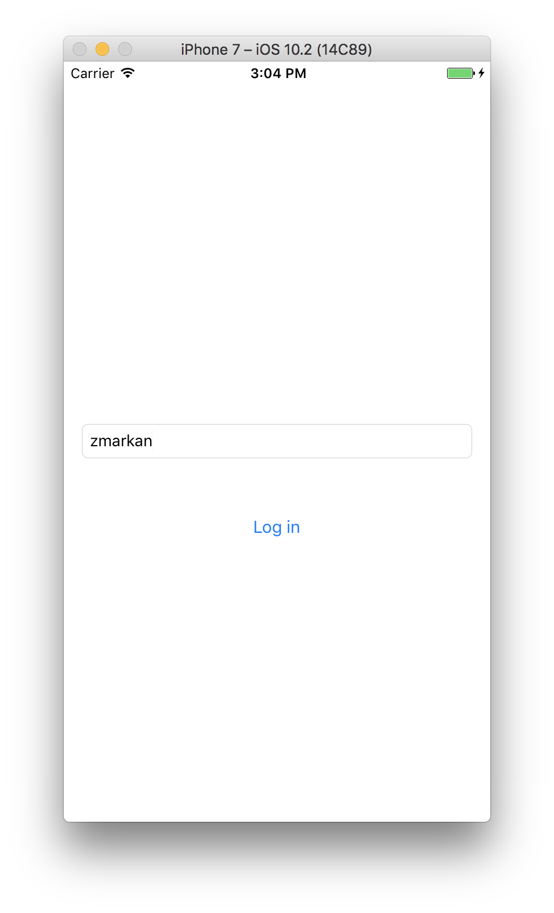
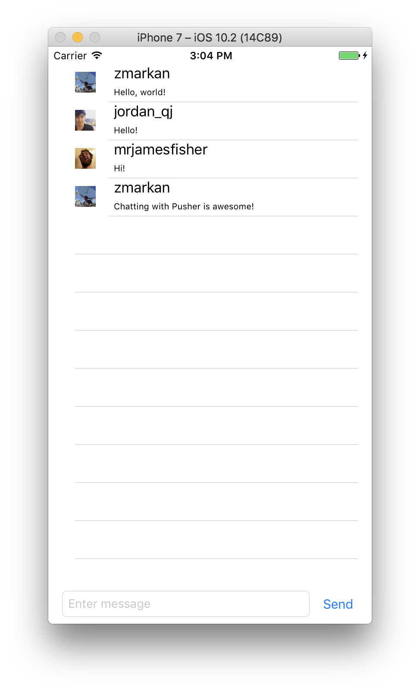

With the [4.0 release of our Swift library](https://github.com/pusher/pusher-websocket-swift), we thought we'd create a walkthrough of how to easily build a mobile chat app with Pusher. Together we will build a group chat application, leading you through how to use Pusher to send and show realtime messages in your UI.

bla bla bla intro b la bla bla

## The app we're building

The app we're building can be downloaded at the App Store (maybe), alongside with its Android and Web counterparts. Add links.
It has two screens - the "Login" screen where we enter our Twitter username, and the "Chat" screen where we do the messaging.

Login Screen:


Chat Screen:


## Setting up our project with XCode

If you haven't yet, create a new application on XCode. By default the wizard offers you to create a Single View Application for iOS, and that's perfectly fine. Once you've done that, you'll need to prepare the dependencies for the app. The dependencies you need are Pusher Swift for interaction with Pusher, and AlamofireImage for performing network requests, and loading images over the network.

The easiest way install dependencies is by using CocoaPods. If you don't have CocoaPods installed you can install them via RubyGems.

```
gem install cocoapods
```

Then configure CocoaPods in our application. First initialise the project by running this command in the top-level directory of your XCode project:

```
pod init
```

This will create a file called `Podfile`. Open it, and make sure to add the following lines specifying your app's dependencies:


TODO:
```language-ruby
# Uncomment the next line to define a global platform for your project
# platform :ios, '9.0'

target 'Pusher Chat Sample iOS' do
  # Comment the next line if you're not using Swift and don't want to use dynamic frameworks
  use_frameworks!

  # Pods for Pusher Chat Sample iOS
  pod 'PusherSwift'
  pod 'AlamofireImage' //need that for networking

end
```

And then run `pod install` to download and install both dependencies.

```
pod install
```

CocoaPods will ask you to close XCode if it's currently running, and open the newly generated `.xcworkspace` file. Do this now, and XCode will open with your project configured.

## Creating the Login View

For our login feature we'll just create a simple page with a field to enter a twitter handle and a login button.

First rename our scene to "Login Scene", and then drag the two elements onto it.
Also rename the `ViewController` to `LoginViewController`.

`Control-drag` the each element into the `LoginViewController` class to create the IBOutlet (for the TextView) and the IBAction for the button.
(TODO: expand this drawing shit)


In your `LoginViewController.swift` add the following logic to the `loginButton` function:

```language-swift

@IBAction func loginButton(_ sender: Any) {
       if(twitterHandle.hasText){
           let messagesViewController = self.storyboard?.instantiateViewController(withIdentifier: "chatViewController") as! ChatViewController
           messagesViewController.twitterHandle = twitterHandle.text!
           self.present(messagesViewController, animated:true)
       }
       else{
           print("No text in textfield")
       }
}

```

This will grab the current text in the `twitterHandle` field and set it to the `ChatViewController`, and transition to the Chat screen.

## Chat View

### TODO: storyboard stuff


### Listening to messages

We will listen to new messages in realtime by subscribing to the `chatroom` channel and listening to events tagged `new_message`.
Pusher channels can support unlimited number of message types, but in our case we are only interested the single one.

In `viewDidLoad` create your Pusher instance - and copy your setup details from the Pusher Dashboard. It shoud look like this:

```language-swift
pusher = Pusher(
          key: "ed5b0a28bf1175148146"
)
```

Then subscribe to the `chatroom` channel, and bind to the `new_message` events, printing their messages to the console. Lastly, connect to Pusher.

```language-swift
let channel = pusher!.subscribe("chatroom")
let _ = channel.bind(eventName: "new_message", callback: { (data: Any?) -> Void in

    if let data = data as? [String: AnyObject] {

        let text = data["text"] as! String
        let author = data["name"] as! String
        print(author + ": " + text)
    }
})
pusher!.connect()
```

Now that we've subscribed and listening to the events, we can send some events to test it out. The easiest way to do this is by using Pusher's Debug Console - in your app's Dashboard. Have the application running - Simulator is fine.
Click Show Event Creator button, and change the name of Channel to `chatroom`, and change the Event to `new_message` - what we're listening to in the app.
Now change the Data field to something like:

TODO: screenshot of channel occupied?

```language-javascript
{
  "name": "John",
  "text": "Hello, World!"
}
```

And click Send event. In the XCode's console, you should see the message printed out:

```
John: Hello, World!
```

### Presenting messages in a table

TODO: screenshot

Now, let's show the messages as they arrive in the UITableView.

TODO: storyboard crap

Create a `MessageCell.swift` class and make it extend `UITableViewCell`. This will represent a single chat message as a row in our table. Drag the outlets for `authorAvatar`, `authorName`, and `messageText` into the class. This

```
import Foundation
import UIKit

class MessageCell: UITableViewCell {
    @IBOutlet var authorAvatar: UIImageView!
    @IBOutlet var authorName: UILabel!
    @IBOutlet var messageText: UILabel!
}
```

Now create a `Message.swift` which will hold a struct representing a single Message object. It just needs to hold two strings, for the author and message.

```language-swift
import Foundation

struct Message {

    let author: String
    let message: String

    init(author: String, message: String) {
        self.author = author
        self.message = message
    }
}
```

Back in the `ChatViewController.swift`, make the class implement the protocols `UITableViewDataSource` and `UITableViewDelegate` alongside `UIViewController`:

```language-swift
class ChatViewController: UIViewController, UITableViewDataSource, UITableViewDelegate {
```

To make it compile, you'll need to implement the following methods - first one to let the tableView know how many items it holds:

```
func tableView(_ tableView: UITableView, numberOfRowsInSection section: Int) -> Int {
       return array.count
   }
```

And the second one that will create a `MessageCell` object:

```
func tableView(_ tableView: UITableView, cellForRowAt indexPath: IndexPath) -> UITableViewCell {

    let cell = tableView.dequeueReusableCell(withIdentifier: "MessageCell", for: indexPath) as! MessageCell
    return cell
}
```

Then we need to add some logic that will actually present the data in a cell. Add these lines to the second method:

```
let message = array.object(at: indexPath.row) as! Message

cell.authorName.text = message.author
cell.messageText.text = message.message

let imageUrl = URL(string: "https://twitter.com/" + message.author + "/profile_image")
cell.authorAvatar.af_setImage(withURL: imageUrl!)
```

First we set up the text in the author and message labels, and lastly we use the AlamofireImage library to load the image from Twitter avatar into the `authorImage` field.

## Sending messages from the app

### Building the serverside component in NodeJS

So far, we've created a client that receives items. But what about sending them? We'll do that next.
First, we'll need a server-side component that receives messages and sends them back to Pusher. //TODO: get Jim to make a diagram

We prepared a simple plug&play NodeJS application that will serve that purpose. You can find it here.

First clone the repository and CD into its directory. Then run `npm install` to setup dependencies.

Then open `app.js` and change the Pusher initialisation fields there to include your App ID, key and secret. Get these from your Dashboard.

Once you've done that you can launch the app by running `node app.js`.

If your iOS app is running on your simulator, and your Node app is running the server, you should be able send a test message via the `cURL` command:

```
$ curl -X "POST" "http://localhost:3000/messages" -H "Content-Type: application/json; charset=utf-8" -d $'{"name": "Pusher","text": "Hello, Node!"}'
```

If everything works as it should, you should see the new message appear in your app.

## Building the app component

- TODO: Wire the Send button
- TODO: Wire the text field

The last thing to do is to create the function that triggers and sends the message to us:

```
func postMessage(name: String, message: String){

        let params: Parameters = [
            "name": name,
            "text": message
        ]

        Alamofire.request(ChatViewController.MESSAGES_ENDPOINT, method: .post, parameters: params).validate().responseJSON { response in

            switch response.result {

            case .success:
                print("Validation successful")
            case .failure(let error):
                print(error)
            }
        }
}
```

Try it!

## Get Pushing

Hopefully you have found this a straightforward example of how to build realtime mobile apps with Pusher. There are many ways you can extend this tutorial for an improved application:

* Use Pusher client events to send messages from one client to another. You could use our webhooks to notify your server when messages are sent, allowing you to persist them in your database.
* Use Pusher presence channels to create live user lists and show who’s online in realtime.
* Use our [REST API](http://pusher.com/docs/server_api_guide/interact_rest_api) to determine whether a user is connected to Pusher. If they are, go ahead and send them a message as normal. If not, send them a native push notification leading them back to your app.

Even with such a basic app, hopefully I have shown you how easy and few lines of code it is to drop in Pusher to any iPhone app. Feel more than free to [let us know](http://twitter.com/pusher) what you end up building with Pusher and iPhone!


<!--


- Link all these guys to the viewcontroller field


### Sending messages


## Steps to present/describe:

- Rename the viewcontroller to Login
- Rename the class to login
- add login text box
- add login submit button

- Create a new viewcontroller for chat
- Create the Text box & Button
- Create UITableView


- Start pusher

## Receive messages from Pusher
- create app
- add credentials
- reload table
- AlamofireImage to get images

## Server-Side

- npm setup
- use pusher details
- node run
- Copy the server endpoint

## Sending messages
- Alamofire to send messages
- _fin_


Pusher is now be installed! Be sure to keep your application credentials to hand when we start adding some realtime magic. You can find your credentials when you create an app after [signing up for a free account](https://pusher.com/signup).

The flow of our app will be like so: the user will input a message in their app, which will send a POST request to our server. In this example, I will use a simple NodeJS server to provide a single API endpoint, for which you can see the code. However, as we have a consistent top-level API across [all our server libraries](http://pusher.com/docs/libraries), what is shown here can be easily applied to any other web framework you wish to use.

Once our server receives the POST request, they will trigger a simple Pusher message to all connected clients, which will show the messages in realtime. If you wish to demo the iPhone app, you can clone  [the source on GitHub](https://github.com/pusher/iphone-chat-example), and this will allow you to chat with our [web version](http://pusher-chat-demo.herokuapp.com) to test things out.

If you get stuck at any point, feel free to browse the iOS source code [here](https://github.com/pusher/iphone-chat-example) and the NodeJS server code [here](https://gist.github.com/jpatel531/687931f2b65c13c9ffe9).

## Sending Messages

### Client-Side

So to set up, create a new blank app. Now we need to create the input bar for our chat messages. We'll use storyboards.

```language-markup
some pictures of storyboards
```


This will stick to the bottom of our view, and have an input (i.e. an `FIXME`) for typing messages, and a `Button` for sending them, which we have given the respective IDs of `message_input` and `send_button`.

<div style="text-align:center">
FIXME SCREENSHOT OF IPHONE WITH BLANK CHAT

</div>

Now in our `SOMETHING APP DELEGATE` class, let's set up the listener for pressing the 'Send' button.

```language-swift
SOME SWIFT TO FIND THE SEND BUTTON AND ATTACH A LISTENER FUNCTION
```

Now we'll have to implement the listener. Here we'll simply get the text of the input and POST it to our server.

```language-swift
SOME SWIFT TO SHOW LISTENER FUNCTION CALLING postMessage
    private void postMessage()  {
    }
```

In this tutorial, I'll be using the FIXME SWIFT HTTP library to send messages to our server.

So now, within our `FIXME`'s `postMessage` method, we'll get the text of the `messageInput`, and POST it, along with a `username` and timestamp. In our example app, we've also implemented a `LoginActivity` to get the user's Twitter username, but in order to focus on the chat element itself we're going to skip this. But feel free to [browse the source code](https://github.com/pusher/iphone-chat-example); it should be fairly straightforward.

Let's go ahead with creating and sending our request parameters:

```language-swift
SOME SWIFT SHOWING postMessage MAKING AN HTTP REQUEST
```

Set a `MESSAGES_ENDPOINT` string in `MainActivity` to point to the URL of your server. Then let's make it so that when the request is successful, it clears the `messageInput`, or when it fails it alerts the user that something went wrong:

```language-swift
SOME SWIFT HANDLING HTTP RESPONSE, CLEARING THE INPUT BOX, HANDLING ERRORS
});
```

Sweet - so now the client is set up to send an input to the server, let's implement our mini-API.

### Server-Side

Install [NodeJS](https://nodejs.org/en/) and [Express](http://expressjs.com/) if you haven't already. Generate your chat backend with:

	$ express chat-backend
	$ cd chat-backend
	$ npm install

Now install the [Pusher Node library](http://github.com/pusher-http-node) with:

	$ npm install pusher --save

Now initialize the `Pusher` object in your server file with your application credentials:

```language-javascript
var pusher = new Pusher({
  appId: "your app id",
  key: "your app key",
  secret: "your app secret"
});
```

Now create the endpoint that receives JSON from the client. Then we'll fire a Pusher event called `new_message` on a channel called `messages`, passing along the data we received from the client.

```language-javascript
app.post('/messages', function(req, res){
  var message = req.body;
  pusher.trigger('messages', 'new_message', message);
  res.json({success: 200});
});
```

At this point, you may wish to store messages, or sanitize them with a library such as [sanitize-html](https://github.com/punkave/sanitize-html) so that you can display them on a web view. But this should be enough to demonstrate our chat app at work.

So fire up your server, and run your mobile app either in an emulator or on your device. Meanwhile, open up the Pusher Debug Console for your app on [your dashboard](http://dashboard.pusher.com). On your emulator or device, you should see an input bar at the bottom of the app. Type in a message and touch the 'Send' button, and you should see messages pop up in realtime on your Debug Console. Cool, huh?

## Showing Live Chat Messages

That might be cool - but it's not enough. Let's have our iPhone client listen for incoming chat messages, and show them in a list.

So in our storyboard, add a new `ListView` something above our input bar. Your layout should look like so:

```
SOME PICTURE OF STORYBOARD SHOWING LIST VIEW OF MESSAGES
```

In order to display each message within the list, we'll have to create an adapter that turns a list into a set of views. In our APP DELEGATE method, let's bind our `ListView` to this adapter:

```language-swift
SOME SWIFT SHOWING A LINK TO THE UI LIST OF MESSAGES
```

Our `Message.swift` class which comprises the list is very straightforward:

```language-swift
FIXME MAKE THIS SWIFT
public class Message {
    public String text;
    public String name;
    public long time;
}
```

Now let's create our `MessageAdapter`, which is, as you can see above, initialized with our `MainActivity`'s context, and the resource (an `ArrayList` of `Message`s):

```language-swift
SOME SWIFT SHOWING A MESSAGE LIST MODEL
```

```language-swift
SOME SWIFT SHOWING HOW TO DISPLAY THE MESSAGES IN THE MODEL
```

Finally we'll have to implement `getView`, which is needed to convert an item in the `ArrayList` of `Message`s to a view. First, we need to create a `MessageViewHolder` to encapsulate the views we need to be a part of the message. In this case, we're going to have a `thumbnailImageView` - for the user's Twitter avatar - a `senderView` to show who sent the message, and a `bodyView` to show the content of the message. Within our `MessageAdapter`, add a private nested class:

```language-swift
MAKE THIS SWIFT
    private static class MessageViewHolder {
        public ImageView thumbnailImageView;
        public TextView senderView;
        public TextView bodyView;
    }
```

We must also describe the layout of our message view. Let's give the view of our thumbnail an ID of `img_thumbnail`, the view of the sender and ID of `message_sender`, and the content of the message an ID of `message_sender`:

```
SOME STORYBOARD THING SHOWING AN INDIVIDUAL MESSAGE WITH A THUMBNAIL, SENDER NAME, AND MESSAGE CONTENT
```

Now that we have a `MessageViewHolder` to encapsulate the visual elements that comprise a message, and a message layout to inflate those elements into, we can go ahead and implement our `MessageAdapter#getView` method:

```language-swift
SOME SWIFT SHOWING HOW TO LOAD TWITTER AVATARS AND SHOW MESSAGES
```

This method will either find or create a `MessageViewHolder` associated with the `convertView` at a certain position in the list. When it has done so, it will set the text of the `bodyView`, `senderView`, and - as in the demo app linked in our introduction - show the Twitter avatar of the sender.

When we listen for Pusher events we will want to add any new messages to our `MessageAdapter`. Let's do so now:

```language-swift
SWIFTIFY
    public void add(Message message){
        messageList.add(message);
        notifyDataSetChanged();
    }
```

This will add the message to the `messageList` and `notifyDataSetChange()` will refresh the adapter, showing the new message.

So now we can go back to `APP DELEGATE` and start listening for Pusher messages:

```language-swift
SWIFTIFY
    @Override
    protected void onCreate(Bundle savedInstanceState) {

  		 ...

		 // initialize Pusher
        Pusher pusher = new Pusher("YOUR_APP_KEY");


	     // subscribe to our "messages" channel
        Channel channel = pusher.subscribe("messages");

		  // listen for the "new_message" event
        channel.bind("new_message", new SubscriptionEventListener() {
			...
        });

        // connect to the Pusher API
        pusher.connect();

    }
```

So now that we have initialized Pusher, connected to the API, and subscribed to the `messages` channel, we can now add our `SubscriptionEventListener` to execute when an event comes in. All we'll need to do is parse the JSON (in this example I have used the [Gson library](https://github.com/google/gson) into a `Message` object and then add it to the `MessageAdapter`:

```language-swift
SWIFTIFY
channel.bind("new_message", new SubscriptionEventListener() {

    @Override
    public void onEvent(String channelName, String eventName, final String data) {
        runOnUiThread(new Runnable() {
            @Override
            public void run() {
                Gson gson = new Gson();
                Message message = gson.fromJson(data, Message.class);
                messageAdapter.add(message);

                // have the ListView scroll down to the new message
                messagesView.setSelection(messageAdapter.getCount() - 1);
            }

        });
    }

});
```


Now that whenever we have a `new_message` event come in, we can simply add it to our `MessageAdapter`, and new messages will appear in realtime! Run your app on an emulator or device, and give it a spin. If you encounter any issues, do consult the [source code](http://github.com/pusher/iphone-chat-example).

<div style="text-align:center">
SCREENSHOT OF IPHONE APP WITH MESSAGES

</div>

## Get Pushing

Hopefully you have found this a straightforward example of how to build realtime mobile apps with Pusher. There are many ways you can extend this tutorial for an improved application:

* Use Pusher client events to send messages from one client to another. You could use our webhooks to notify your server when messages are sent, allowing you to persist them in your database.
* Use Pusher presence channels to create live user lists and show who’s online in realtime.
* Use our [REST API](http://pusher.com/docs/server_api_guide/interact_rest_api) to determine whether a user is connected to Pusher. If they are, go ahead and send them a message as normal. If not, send them a native push notification leading them back to your app.

Even with such a basic app, hopefully I have shown you how easy and few lines of code it is to drop in Pusher to any iPhone app. Feel more than free to [let us know](http://twitter.com/pusher) what you end up building with Pusher and iPhone! -->
